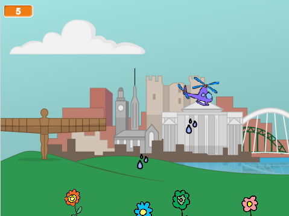

## Cyflwyniad

Rwyt ti mynd i ddysgu sut i greu gên lle mae hofrennydd yn ennill pwyntiau trwy roi dŵr i flodau yn y ddinas.

<div class="scratch-preview">
  <iframe allowtransparency="true" width="485" height="402" src="https://scratch.mit.edu/projects/embed/110929020/?autostart=false" frameborder="0"></iframe>
  
</div>

--- collapse ---
---
title: Nodiadau i Wirfoddolwyr
---

## Adnoddau
Ar gyfer y prosiect yma, dylid defnyddio Scratch 2.  Mae modd defnyddio Scratch 2 arlein yma [jumpto.cc/scratch-on](http://jumpto.cc/scratch-on) neu mae modd ei lawrlwytho yma [jumpto.cc/scratch-off](http://jumpto.cc/scratch-off) a'i ddefnyddio heb gysylltiad gwe.

Mae'r ddolen 'Adnoddau Prosiect' ar gyfer y prosiect yma yn cynnwys yr adnoddau canlynol:

## Anoddau Gwirfoddolwyr

Mae modd gweld y prosiect wedi ei gwblhau yma <a href="http://scratch.mit.edu/projects/110929020/#editor">online</a>, neu mae modd ei lawrlwytho wrth glicio ar ddolen 'Adnoddau'r Prosiect' ar gyfer y prosiect yma, sydd yn cynnwys:

+ GreenYourCity.sb2

## Adnoddau Prosiect

Ar gyfer y prosiect yma, mae modd i aelodau'r clwb ddefnyddio prosiect Scratch sydd yn cynnwys yr adnoddau angenrheidiol. Mae'r prosiect ar gael yma [jumpto.cc/city-resources](http://jumpto.cc/city-resources), neu mae modd ei lawrlwytho gan glicio'r 'Adnoddau Prosiect' sydd yn cynnwys: 

+ GreenYourCityResources.sb2

Sicrhewch fod gan bob plentyn fynediad i gopi o'r adnoddau yma.

## Nodau Dysgu
+ Mae'r prosiect yma yn atgyfnerthu y sgiliau rhaglenni sydd wedi eu dysgu hyd yn hyn.

Mae'r prosiect yma yn trin elfennau sydd yn rhan o'r adran ganlynol o [Faes Llafur Gwneud Digidol Raspberry Pi](http://rpf.io/curriculum):

+ [Cyfuno adeiladwaith rhaglenni i ddatrys problem.](https://www.raspberrypi.org/curriculum/programming/builder)

## Heriau
+ "Animeiddio dy hofrennydd" - defnyddio bloc `gwisg nesaf`{:class="blocklooks"} i animeiddio dy hofrennydd;
+ "Gormod o ddŵr" - defnyddio bloc `aros`{:class="blockcontrol"} i arafu'r dŵr sy'n cael ei ollwng;
+ "Cadw sgôr" - ychwanegu newidyn `sgôr`{:class="blockdata"} i'r gêm, sydd yn cynyddu bob tro mae'r blodyn yn cael ei dyfrio;
+ "Blodau yn arnofio" - sicrhau bod y blodau ond yn symud os nad ydynt yn ddigon uchel.

## Cwestiynau a Ofynir yn Aml
+ Y ffordd mwyaf syml i symud yr hofrennydd ar draws y llwyfan yw defnyddio'r côd canlynol:

```blocks
  ailwna hyd at <cyffwrdd [ymyl v] ?> 
    symud (3) cam
  end
```

--- /collapse ---
