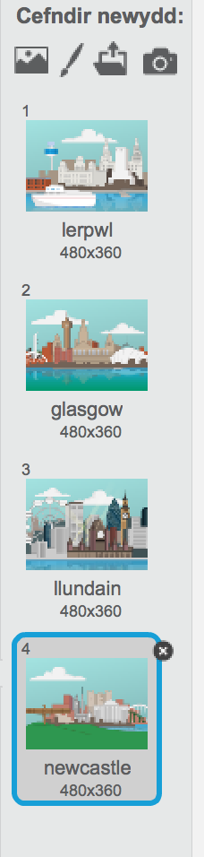
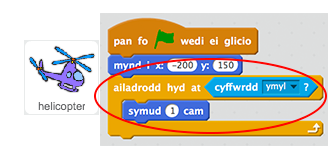
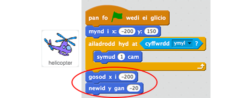
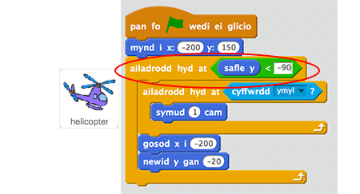
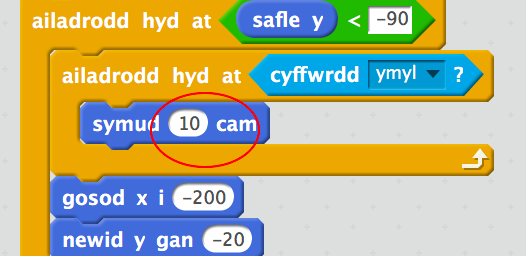

## Hofrennydd

Fe awn ati i ychwanegu côd i dy hofrennydd i symud ar draws y llwyfan.

+ Agora prosiect Scratch 'Gwyrddio'r Ddinas'.  Bydd arweinydd y clwb yn rhoi copi o'r prosiect i ti, neu alli di ei agor arlein yma <a href="http://jumpto.cc/city-resources" target="_blank">jumpto.cc/city-resources</a>.

	Dyma sut ddylai'r prosiect edrych: 

	

+ Clicia dy lwyfan ac yna clicia 'Cefndiroedd'. Mae modd i ti ddewis cefndir dinas gwahanol i dy gêm. Alli di hyd yn oed glicio'r botwm 'Dewis cefndir' i ddewis cefndir gwahanol o lyfrgell Scratch.

	

+ Ychwanega'r côd yma fel bod dy hofrennydd yn cychwyn yn ochr top-chwith y llwyfan.

	

+ Ychwanega côd fel bod dy hofrennydd yn symud i'r dde tan ei fod yn cyrraedd ymyl y llwyfan.

	

+ Profa dy hofrennydd trwy glicio ar y faner werdd. Fe ddylai symud ar draws top y llwyfan tan ei fod yn cyrraedd yr ochr arall.

	

+ Unwaith mae wedi cyrraedd yr ymyl, fe ddylai dy hofrennydd fynd yn ôl i'r ochr chwith a symud i lawr ychydig.

 	

 	Sylwa mai'r blociau rwyt ti angen eu defnyddio yw `gosod x`{:class="blockmotion"} a `newid y`{:class="blockmotion"}.

+ Yn olaf, mae angen i ti ail-adrodd y symudiad yma tan fod dy hofrennydd ar waelod y sgrin (a bod ei safle yn llai 'na -90).

 	

+ Profa dy hofrennydd eto. Fe ddylai symud ar draws a lawr tan ei fod yn cyrraedd gwaelod y llwyfan.

	Mae modd i ti wneud y profi yn gynt trwy gyflymu dy hofrennydd.

	 
