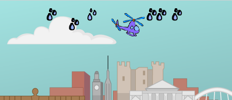

## Dŵr

Awn ati ti ychwanegu côd i dy hofrennydd i ollwng dŵr dros y blodau.

+ Ychwanega gôd i giplun dy __hofrennydd__ i greu clôn diferion o ddŵr pryd bynnag mae'r bylchwr yn cael ei wasgu.

	

+ Ychwanega gôd i dy giplun __water drops__, fel ei fod yn cuddio pan mae'r gêm yn cychwyn.

	

+ Fe alli di wedyn ychwanegu côd fel bod pob clôn yn ymddangos lle bynnag mae'r hofrennydd.

	

+ Profa dy gôd trwy glicio ar y faner ac yna gwasgu'r bylchwr. Fe ddylai clôn diferyn o ddŵr ymddangos pryd bynnag mae'r bylchwr yn cael ei wasgu.

	

+ Nawr mae angen i ti wneud i'r diferion o ddŵr gwympo i'r ddaear.

	

+ Profa dy ddiferion o ddŵr eto. Y tro yma fe ddylent gwympo i'r ddaear.

	

