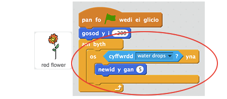
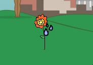
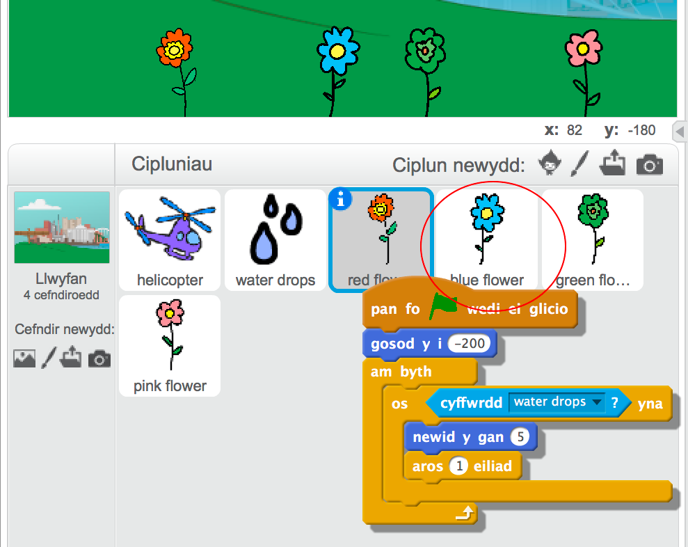

## Blodau

Fe awn ati i ychwanegu côd i dy flodau i dyfu pan maent yn cael eu dyfrio.

+ Ychwanega côd i dy giplun __red flower__ i'w symud i waelod y llwyfan ar ddechrau'r gêm.

	

+ Fe ddylai dy flodyn symud fyny pryd bynnag mae diferyn o ddŵr yn ei gyffwrdd.

	

+ Clicia'r faner werdd a profa dy flodyn coch trwy ollwn diferion o ddŵr arno. Ydy'r blodyn coch yn symud fyny pan mae'n cael ei daro gan ddŵr?

	Wyt ti wedi sylwi bod dy flodyn yn __cadw__ symud fyny pan mae'n cyffwrdd y dŵr?

	

	Alli di ychwanegu bloc `aros`{:class="blockcontrol"} fel fod y blodyn dim ond yn symud fyny unwaith bob tro.

+ Gwna gopi o gôd dy flodyn coch i'r cipluniau blodau eraill. I wneud hyn, llusga'r côd i'r cipluniau eraill.

	

