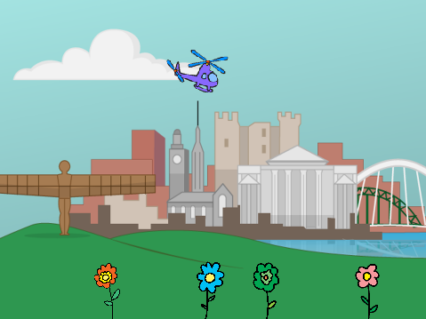
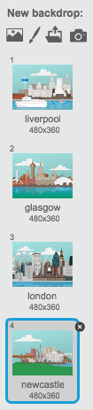
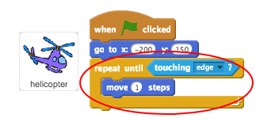
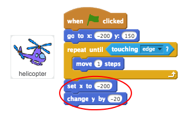
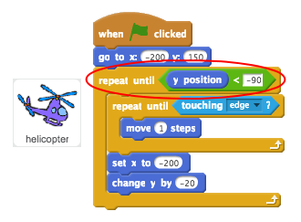
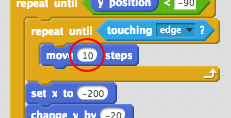

## Helicopter

Let's code your helicopter to move across the stage.

+ Open the 'Green Your City' Scratch project. Your club leader will give you a copy of this project, or you can open it online at <a href="http://jumpto.cc/city-resources" target="_blank">jumpto.cc/city-resources</a>.

	Here's how the project should look:

	

+ Click your stage and then click 'Backdrops'. You can then choose a different city backdrop for your game. You can even click the 'Choose backdrop' button to choose a different backdrop from the Scratch library.

	

+ Add this code so that your helicopter starts in the top-left of the stage.

	

+ Add code so that your helicopter moves to the right until it reaches the edge of the stage.

	

+ Test your helicopter by clicking the green flag. It should move across the top of the stage until it reaches the other side.

	

+ Once it has reached the edge, your helicopter should go back to the left side of the stage and move down slightly.

 	

 	Notice that the blocks you need to use are `set x`{:class="blockmotion"} and `change y`{:class="blockmotion"}.

+ Finally, you need to repeat this movement until your helicopter is at the bottom of the screen (its y position is less than -90).

 	

+ Test your helicopter again. It should move across and down until it gets to the bottom of the stage.

	You can make testing quicker by speeding up your helicopter.

	 

