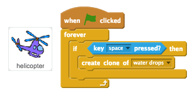
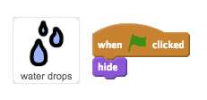
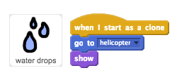
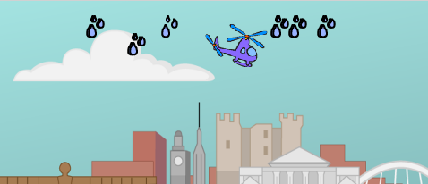
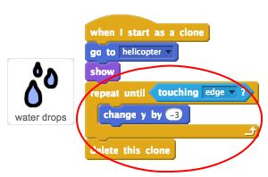
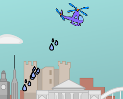

## Water

Let's code your helicopter to drop water onto your flowers.

+ Add code to your __helicopter__ sprite, to create a new water drops clone whenever the space key is pressed.

	

+ Add code to your __water drops__ sprite, so that it is hidden when the game starts.

	

+ You can then add code so that each new clone appears wherever the helicopter is.

	

+ Test your code by clicking the flag and then pressing the space bar. A water drop clone should appear whenever space bar is pressed.

	

+ Now you need to make the water drops fall to the ground.

	

+ Test your water drops again. This time they should fall to the ground.

	

