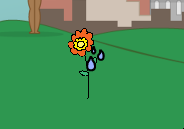

## Flowers

Let's code your flowers to grow when they are watered.

+ Add code to your __red flower__ sprite to move it to the bottom of the stage at the start of the game.

    

+ Your flower should move upwards whenever it's touching a water drop.

    

+ Click the green flag and then test your red flower by dropping some water drops onto it. Does the red flower move upwards when hit?

    Have you noticed that your flower __keeps__ moving up when it's touching the water?

    

    Can you add a `wait`{:class="blockcontrol"} block so that the flower only moves up once each time.

+ Copy your red flower code to your other flower sprites. To do this, just drag the code onto the other sprites.

    

